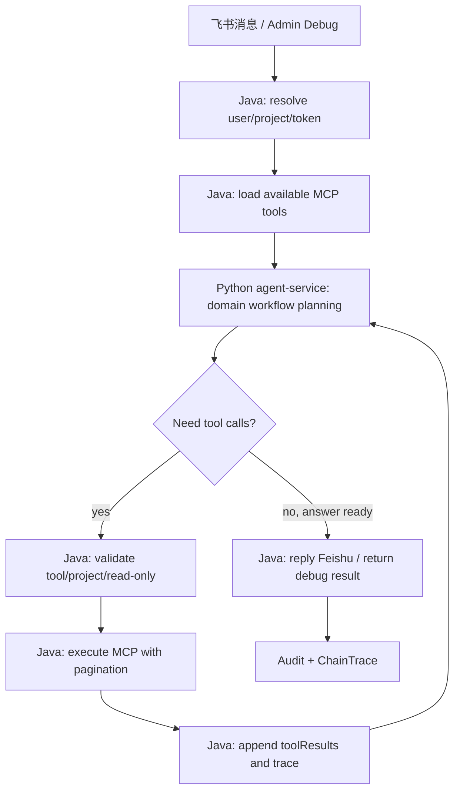

# 项目问答智能体增强技术方案

## 1. 总体设计

本方案增强 Python `agent-service` 作为智能规划层，Java 后端继续作为安全执行层。

核心原则：

- 规则负责确定性任务：项目别名、时间范围、业务域、表单优先级、分页约束。
- 模型负责非确定性任务：候选表单排序解释、跨表单洞察、管理报告式总结。
- Java 保持边界：权限、token、MCP 执行、分页落地、审计、链路追踪。
- Python 只返回结构化计划和总结，不接触 MCP token。

## 2. 现状基线

现有相关模块：

- Python 智能层：
  - `agent-service/app/agent_graph.py`
  - `agent-service/app/project_workflow.py`
  - `agent-service/app/skills.py`
  - `agent-service/app/models.py`
- Java 执行层：
  - `backend/src/main/java/com/larkconnect/agent/agent/AgentOrchestrator.java`
  - `backend/src/main/java/com/larkconnect/agent/agent/AgentServiceDtos.java`
  - `backend/src/main/java/com/larkconnect/agent/mcp/McpAdapter.java`
  - `backend/src/main/java/com/larkconnect/agent/audit/ChainTraceService.java`

当前 Python `project_workflow` 已有基础流程：

```text
get_base_form_info
  -> match_form_resource
  -> query_form_data_list
  -> batch_get_form_value_detail
  -> summarize_project_workflow
```

需要增强为领域驱动工作流：

```text
DomainIntent
  -> ProjectAliasResolver
  -> TimeRangeResolver
  -> FormDiscoveryPlanner
  -> FormDataQueryPlanner
  -> DetailEnrichmentPlanner
  -> MetricSummarizer
```

## 3. 目标架构



## 4. Python 智能层设计

### 4.1 新增模块

建议新增：

```text
agent-service/app/domain_config.py
agent-service/app/domain_intent.py
agent-service/app/time_range.py
agent-service/app/project_alias.py
agent-service/app/form_planner.py
agent-service/app/metric_summarizer.py
agent-service/app/evaluation.py
agent-service/app/evaluation_cases.json
```

### 4.2 DomainIntent

数据结构：

```python
class DomainIntent(BaseModel):
    domains: list[str]
    projectHints: list[str]
    timeRange: TimeRange
    depth: str = "standard"
    confidence: float
```

业务域枚举：

```text
quality
safety
progress
risk
general
```

识别规则：

- 基于关键词命中生成候选业务域。
- 可多域命中，例如“进度风险”返回 `["progress", "risk"]`。
- 未命中时保留原有通用 MCP 问答路径。

### 4.3 TimeRangeResolver

数据结构：

```python
class TimeRange(BaseModel):
    label: str
    start: str
    end: str
    timezone: str = "Asia/Shanghai"
    source: str
```

支持规则：

| 输入 | 输出逻辑 |
| --- | --- |
| 今天 | 当前日期 00:00:00 到 23:59:59 |
| 昨天 | 当前日期 -1 天 |
| 本周 | 周一到周日 |
| 上周 | 上一个周一到周日 |
| 本月 | 当月 1 日到当月最后一日 |
| 上月/上个月 | 上月 1 日到上月最后一日 |
| 近 N 天 | 当前日期往前 N-1 天到当前日期 |
| 本季度 | 当前季度第一天到最后一天 |
| 上季度 | 上一季度第一天到最后一天 |

默认策略：

- 质量、安全、风险默认近 30 天。
- 进度默认本周。

### 4.4 ProjectAliasResolver

轻配置结构：

```yaml
projects:
  - projectId: roche
    projectName: 罗氏诊断项目
    aliases:
      - 罗诊
      - 罗氏诊断
      - Roche
      - 罗氏
```

解析规则：

- 先匹配 Java 传入的 `projects` 中的 `projectId` 和 `projectName`。
- 再匹配轻配置别名。
- 群聊已有项目上下文时默认使用群项目。
- 多项目命中时返回澄清问题。

### 4.5 FormDiscoveryPlanner

轻配置结构：

```yaml
domains:
  quality:
    keywords: [质量, 缺陷, 整改, 验收, 关注项]
    coreForms: [质量缺陷清单, 重点质量关注项]
    supplementalForms: [质量检查, 质量验收, 质量巡检]
    excludeForms: [安全, 进度, 合同]
```

规划逻辑：

1. 根据 `DomainIntent.domains` 获取核心表单关键词。
2. 对每个关键词生成 `match_form_resource` 调用。
3. 收到候选表单后排序：
   - 核心表单精确命中。
   - 业务域关键词命中。
   - 补充表单命中。
   - 排除词降权。
4. 对高置信候选生成 `query_form_data_list`。
5. 对低置信候选生成澄清问题。

### 4.6 FormDataQueryPlanner

`query_form_data_list` 参数策略：

```json
{
  "formId": "form-id",
  "page": 1,
  "pageSize": 100,
  "filter": {
    "createTime": ["2026-06-01 00:00:00", "2026-06-30 23:59:59"]
  }
}
```

分页意图：

```json
{
  "mode": "auto",
  "pageSize": 100,
  "maxPages": 50,
  "maxItems": 5000
}
```

### 4.7 DetailEnrichmentPlanner

详情增强触发条件：

- 列表记录包含未闭环、高严重度、逾期、阻塞等字段。
- 列表记录字段不足，无法形成指标或建议。
- 模型总结前需要关键样例。

默认限制：

- 每个表单最多详情展开 20 条。
- 多表单总详情记录最多 80 条。

### 4.8 MetricSummarizer

质量域指标：

- 记录总数。
- 未闭环数量。
- 高严重度/高优先级数量。
- 状态分布。
- 问题类型分布。
- 责任人/区域/专业分布。
- 重复问题或高频问题。

安全域指标：

- 隐患总数。
- 高风险隐患数。
- 未整改数。
- 逾期整改数。
- 责任区域分布。

进度域指标：

- 当前完成情况。
- 计划偏差。
- 滞后节点。
- 影响路径。

风险域指标：

- 风险总数。
- 高风险项。
- 逾期/阻塞项。
- 责任人和建议动作。

回答必须包含：

- 数据时间范围。
- 数据源表单。
- 成功/失败项目或工具。
- 截断说明。

## 5. ToolCall 协议扩展

Python `ToolCall` 增加字段：

```python
class ToolCall(BaseModel):
    toolName: str
    arguments: dict[str, Any] = Field(default_factory=dict)
    projectIds: list[str] = Field(default_factory=list)
    reason: str | None = None
    pagination: dict[str, Any] | None = None
    purpose: str | None = None
```

Java `AgentServiceDtos.ToolCall` 同步增加：

```java
public record ToolCall(
    String toolName,
    Map<String, Object> arguments,
    List<String> projectIds,
    String reason,
    Map<String, Object> pagination,
    String purpose
) {}
```

兼容要求：

- 老响应没有 `pagination` 和 `purpose` 时，Java 仍按单次工具调用执行。
- `pagination.mode=auto` 时，Java 使用 `McpAdapter.callToolWithPagination`。
- Java 仍校验工具名、项目 ID、只读安全和参数 schema。

## 6. Java 执行层适配

### 6.1 AgentOrchestrator

调整 `executeAgentToolCalls`：

- 读取 `toolCall.pagination`。
- 当 `mode=auto` 时调用分页执行。
- 将每页结果写入 `toolResults`，并带上 page/pageSize/totalCount。
- 链路追踪每页记录为独立 MCP 调用节点。

### 6.2 McpAdapter

现有 `callToolWithPagination` 可作为基础，但需要兼容：

- page/pageSize 形态。
- offset/limit 形态。
- total/totalCount/totalPages。
- items/data/records/list。

建议分页决策：

```text
if arguments has page/pageSize:
  increment page
else if arguments has offset/limit:
  increment offset
else:
  prefer page/pageSize for query_form_data_list
```

### 6.3 ChainTrace

链路追踪补充字段：

- `purpose`
- `pagination`
- `page`
- `pageSize`
- `totalCount`
- `truncated`
- `dataSourceName`

## 7. 轻配置方案

一期建议使用 YAML/JSON 文件，后续迁移到数据库和后台页面。

建议路径：

```text
agent-service/app/domain_config.yaml
```

配置内容：

```yaml
pagination:
  defaultPageSize: 100
  maxPages: 50
  maxItems: 5000

projects:
  - projectId: roche
    projectName: 罗氏诊断项目
    aliases: [罗诊, 罗氏诊断, Roche, 罗氏]

domains:
  quality:
    keywords: [质量, 缺陷, 整改, 验收, 关注项]
    coreForms: [质量缺陷清单, 重点质量关注项]
    supplementalForms: [质量检查, 质量验收, 质量巡检]
    excludeForms: [安全, 进度, 合同]
```

## 8. 评估体系

样例文件：

```text
agent-service/evaluation/project_agent_cases.json
```

样例结构：

```json
{
  "id": "quality_roche_last_month",
  "question": "罗诊项目上个月的质量情况",
  "expectedDomains": ["quality"],
  "expectedProjectIds": ["roche"],
  "expectedTimeRange": {
    "start": "2026-06-01 00:00:00",
    "end": "2026-06-30 23:59:59"
  },
  "expectedToolSequence": [
    "match_form_resource",
    "query_form_data_list"
  ],
  "expectedCoreForms": [
    "质量缺陷清单",
    "重点质量关注项"
  ],
  "expectedAnswerMustContain": [
    "数据范围",
    "质量",
    "建议"
  ],
  "humanScores": {
    "accuracy": null,
    "completeness": null,
    "insight": null,
    "dataScope": null
  }
}
```

评估输出：

```text
tool_selection_accuracy
time_range_accuracy
core_form_accuracy
answer_scope_coverage
failure_disclosure_coverage
```

## 9. 错误处理

| 错误类型 | 处理方式 |
| --- | --- |
| 项目无法识别 | 追问项目名称 |
| 多项目冲突 | 追问选择项目 |
| 无可用 MCP token | 返回配置提示 |
| 无匹配表单 | 说明未发现相关表单，可建议管理员配置 |
| 部分页失败 | 继续分析成功数据，并说明失败影响 |
| 超过分页上限 | 截断并说明 |
| 模型总结失败 | 使用确定性摘要兜底 |

## 10. 测试策略

Python：

- `TimeRangeResolver` 单元测试。
- `ProjectAliasResolver` 单元测试。
- `DomainIntent` 单元测试。
- `FormDiscoveryPlanner` 单元测试。
- `MetricSummarizer` 单元测试。
- 评估样例集完整性测试。

Java：

- DTO 兼容测试。
- 分页意图执行测试。
- 单页失败不中断测试。
- trace 节点字段测试。

端到端：

- 罗诊上个月质量情况。
- 本周安全隐患。
- 当前项目进度风险。
- 所有项目逾期风险。
> **已废弃（2026-07-13）**：本文技术方案已由 `2026-07-13-agent-dual-query-design.md` 取代，仅保留历史参考。
